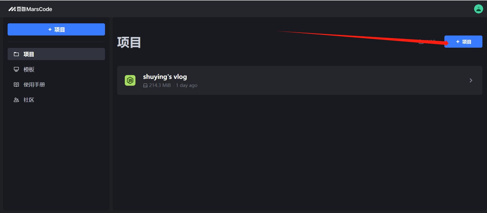
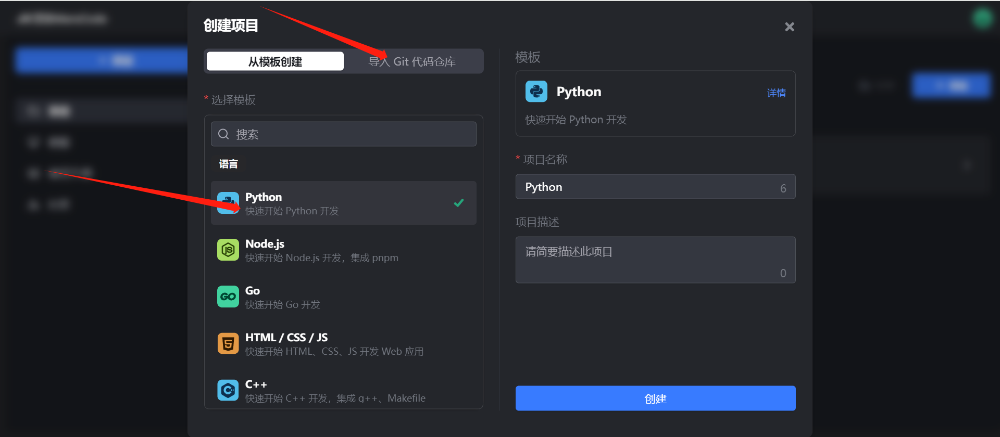
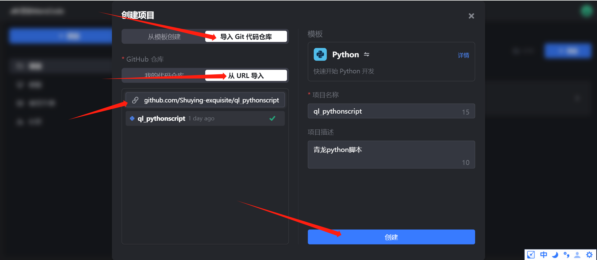
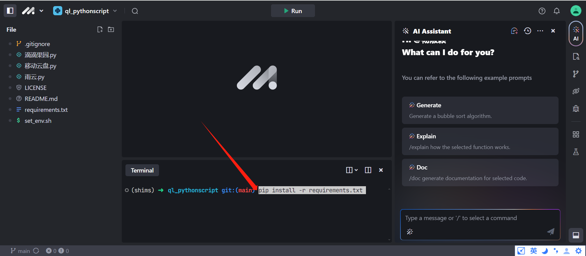
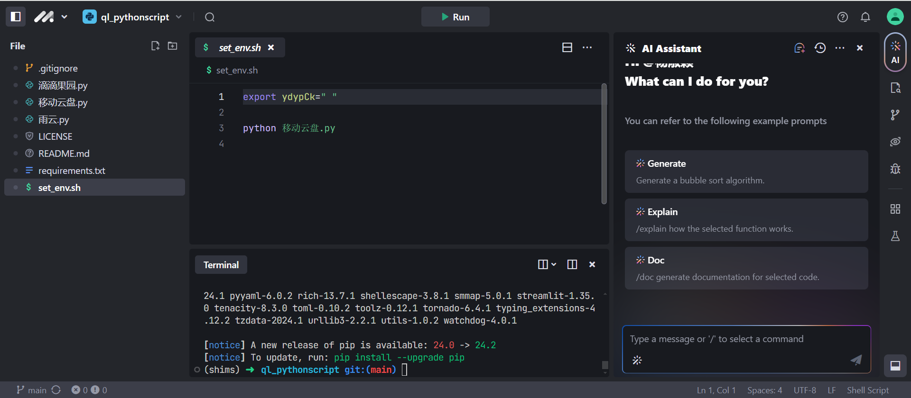
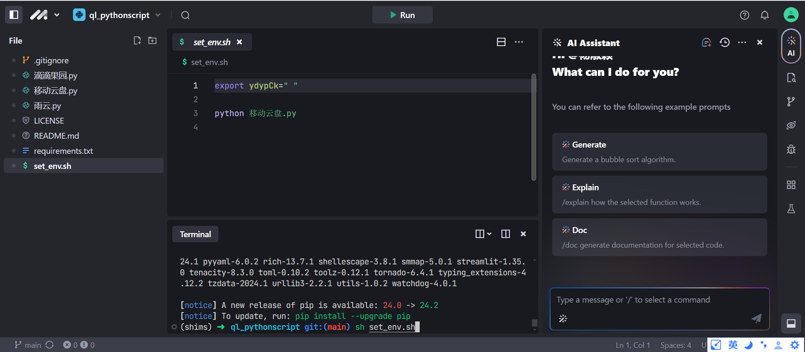
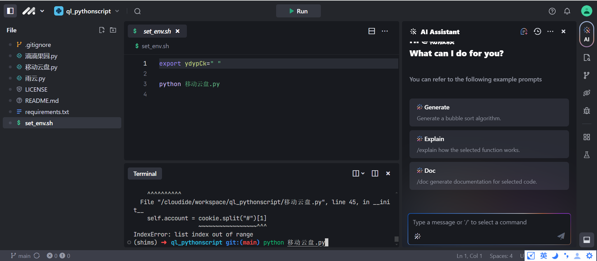

# 使用marscode无面板也能跑脚本

## 前言

没有青龙面板还想跑脚本怎么办？

marscode零费用完美解决！！！！

## 准备工作

1.注册豆包marscode并登录             注册地址：https://www.marscode.cn/

2.创建并导入项目（运行python脚本，创建python项目;运行JavaScript脚本，创建node.js项目）这里以执行python脚本为例子：

代码仓库地址：[Shuying-exquisite/ql_pythonscript: 青龙python脚本 (github.com)](https://github.com/Shuying-exquisite/ql_pythonscript)

ps：注意要使用这个脚本仓库，脚本仓库中有[requirements.txt](https://github.com/Shuying-exquisite/ql_pythonscript/blob/main/requirements.txt)文件用于下一步安装依赖。

## 安装依赖

输入安装依赖指令并回车运行，安装依赖指令：pip install -r requirements.txt

## 设置环境变量（待依赖安装完毕）

环境变量使用shell命令设置，找到set_env.sh，脚本的格式如下所示

export 脚本中的变量名="变量值"————给变量赋值(变量值通过脚本描述获取，这里不做叙述)

python 脚本名称.py————设置任务

对于脚本内赋值变量的脚本，需要找到脚本变量并赋值，把任务填写在set_env.sh

## 执行脚本

输入执行shell脚本的指令，运行set_env.sh中的所有脚本，指令：sh set_env.sh

输入执行python脚本的指令，运行对应的当个脚本，指令：python 脚本名.py

